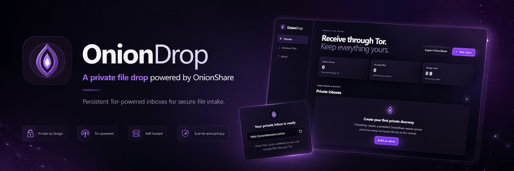

# OnionDrop

OnionDrop is a self-hosted web interface for creating and managing persistent OnionShare receive services. It runs independently on any compatible Docker host, publishes real `.onion` inboxes through the official OnionShare CLI, and stores received content only in the local data directory you mount.

<p align="center">
  
</p>

## Features at a glance

- Multiple persistent OnionShare receive inboxes
- Private inboxes with Tor client authorization or public onion inboxes
- Files and anonymous text messages
- Persistent onion identities across container restarts
- Import and export of OnionShare persistent receive configurations
- Animated Tor connection and bootstrap status
- SHA-256 checksums for received files with a persistent cache
- Selection and download of multiple files as one ZIP archive
- QR codes shown in the browser and downloadable as PNG
- File previews for common media, documents, tables, archives and text formats
- Optional built-in login with scrypt password hashing and login throttling
- First-run setup wizard
- English, German, Spanish, Italian, French, Chinese, Japanese and Russian
- Responsive Tor-inspired interface
- Multiarch image design for `linux/amd64` and `linux/arm64`

## Supported previews

OnionDrop never executes uploaded files. Preview support is intentionally read-only.

| Category | Formats |
|---|---|
| Images | PNG, JPEG, GIF, WebP, BMP, ICO, AVIF |
| Documents | PDF, DOCX, ODT, RTF, EPUB, EML |
| Spreadsheets | XLSX, ODS, CSV, TSV |
| Presentations | PPTX, ODP |
| Audio | MP3, WAV, OGG, M4A, AAC, FLAC, Opus |
| Video | MP4, WebM, OGV, MOV, M4V |
| Text and code | TXT, Markdown, JSON, XML, YAML, TOML, logs and many source-code formats |
| Archives | ZIP, TAR, TGZ, GZ, BZ2, XZ directory listings |

Office and archive previews are deliberately bounded by size and item limits. Unsupported or malformed files remain downloadable but are not rendered.

## Quick start with Docker Compose

```bash
git clone https://github.com/dennysubke/oniondrop.git
cd oniondrop
docker compose up -d
```

Open:

```text
http://localhost:8397
```

On the first visit, OnionDrop asks for the interface language and whether the built-in login should be enabled.

The included Compose file uses:

```yaml
services:
  oniondrop:
    image: dennysubke/oniondrop:0.2.0
    ports:
      - "8397:8080"
    environment:
      PUID: "1000"
      PGID: "1000"
      ONIONDROP_AUTH_MODE: setup
      ONIONDROP_DEFAULT_LANGUAGE: en
    volumes:
      - ./data:/data
```

## Docker command

```bash
docker run -d \
  --name oniondrop \
  --restart unless-stopped \
  -p 8397:8080 \
  -e PUID=1000 \
  -e PGID=1000 \
  -e ONIONDROP_AUTH_MODE=setup \
  -v "$(pwd)/data:/data" \
  dennysubke/oniondrop:0.2.0
```

## Configuration

| Variable | Default | Description |
|---|---:|---|
| `PUID` | `1000` | User ID used for files under `/data` |
| `PGID` | `1000` | Group ID used for files under `/data` |
| `ONIONDROP_DATA_DIR` | `/data` | Persistent application and inbox data |
| `ONIONDROP_HOST` | `0.0.0.0` | Web server bind address |
| `ONIONDROP_PORT` | `8080` | Internal web server port |
| `ONIONDROP_THREADS` | `8` | Waitress worker threads |
| `ONIONDROP_MAX_ACTIVE` | `4` | Maximum simultaneously running OnionShare services |
| `ONIONDROP_AUTH_MODE` | `setup` | `setup`, `enabled`, or `disabled` for a new data directory |
| `ONIONDROP_ADMIN_USERNAME` | `admin` | Initial username when auth mode is `enabled` |
| `ONIONDROP_ADMIN_PASSWORD` | empty | Initial password when auth mode is `enabled` |
| `ONIONDROP_DEFAULT_LANGUAGE` | `en` | `en`, `de`, `es`, `it`, `fr`, `zh`, `ja`, or `ru` |
| `ONIONDROP_SECRET_KEY` | generated | Optional fixed session secret for a new data directory |
| `ONIONDROP_SESSION_HOURS` | `12` | Login session lifetime |
| `ONIONDROP_HTTPS` | `false` | Set to `true` when the UI is served exclusively through HTTPS |
| `ONIONDROP_TRUST_PROXY` | `false` | Trust one reverse-proxy hop for forwarded host/protocol/IP headers |
| `ONIONDROP_MOCK` | `false` | Development-only simulated OnionShare mode |

Environment-based first-run values are written to `/data/settings.json`. Once that file exists, settings are managed from the interface and are not silently replaced on restart.

### Authentication modes

- `setup`: show the first-run setup screen and let the administrator choose.
- `disabled`: start without an application login.
- `enabled`: enable login immediately. `ONIONDROP_ADMIN_PASSWORD` must contain 10–256 characters.

For a public or remotely reachable installation, enable the built-in login and use HTTPS. Do not expose the administration port directly to the public internet.

## Persistent data

Everything that must survive a restart is stored below `/data`:

```text
/data/
├── settings.json       # interface and login settings
├── state.json          # inbox metadata
├── checksums.json      # cached SHA-256 values
├── services/           # persistent OnionShare configurations and identities
├── inboxes/            # received files and messages
├── logs/               # OnionShare service logs
├── home/               # isolated runtime homes for services
└── tmp/                # temporary ZIP downloads
```

Back up the complete data directory. The files under `services/` contain onion identities and, for private services, access credentials. Treat backups as sensitive.

## Updating from 0.1.0

Version 0.2.0 uses the same main `/data` structure and migrates older inbox metadata automatically.

1. Stop the old container.
2. Back up the complete mounted data directory.
3. Change the image tag to `dennysubke/oniondrop:0.2.0`.
4. Start the new container with the same `/data` mount.
5. Complete the new interface/login setup.
6. Verify that each inbox retains its onion address before removing the backup.

Never delete `services/` during an upgrade unless you intentionally want new onion identities.

## OnionShare compatibility

OnionDrop uses the official OnionShare CLI rather than implementing a separate transfer protocol. Inbox configurations are persistent OnionShare receive configurations and can be exported from OnionDrop. Imported configurations retain their supported OnionShare fields while OnionDrop safely forces receive mode and its local inbox data path.

OnionDrop 0.2.0 builds against OnionShare CLI **2.6.4**.

## Security model

- The administration UI controls onion addresses, received files and potentially private authorization keys.
- A private OnionShare service protects access to the receive page, but it does not replace protection for the administration UI.
- The login password is stored as a salted scrypt hash.
- Unsafe API requests require a per-session CSRF token.
- Login attempts are rate-limited in memory.
- Uploaded HTML and SVG are shown as text, not executed as pages.
- Structured previews use decompression and size limits to reduce archive-bomb risk.
- SHA-256 confirms file identity; it does not determine whether a file is safe.
- OnionDrop does not include malware scanning in this release.

## Development

A simulated development mode is included so the interface and file functions can be exercised without starting Tor:

```bash
docker compose -f docker-compose.dev.yml up --build
```

Run the non-web unit tests locally:

```bash
python -m pip install -r requirements-dev.txt
PYTHONPATH=. pytest -q
```

The production image installs the official OnionShare CLI and its pinned web dependencies during the Docker build.

## Optional platform packages

Platform integrations are kept outside the core source. The release archive includes an optional Umbrel package under:

```text
packaging/umbrel/denny-oniondrop/
```

## License

OnionDrop is distributed under the GNU General Public License v3.0 or later. OnionShare is a separate project distributed under GPLv3+ by its contributors.
